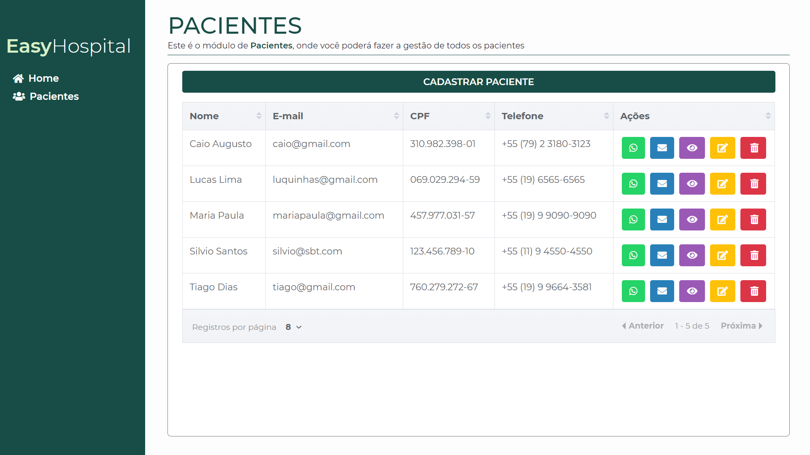
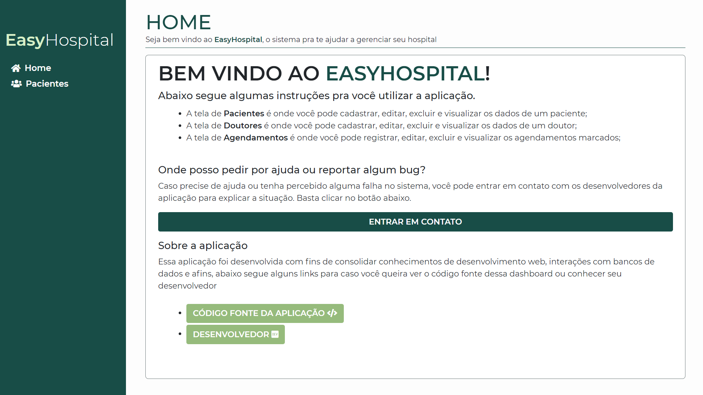
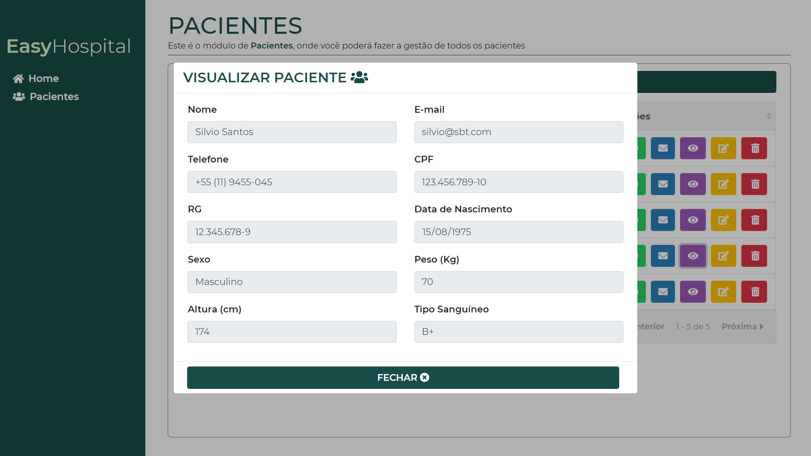
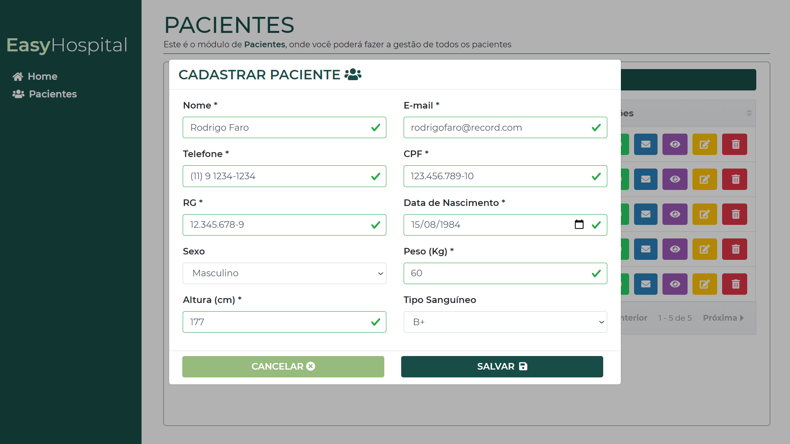

<h1 align="center">
  :hospital: Easy Hospital :hospital:
</h1>

<h4 align="center">
  A web application developed with Node.js in the back-end and Vue.js in the front-end that has the goal of helping in the management of a fictional hospital
</h4>

  
  

  <a href="#technologies">Used Technologies</a>&nbsp;&nbsp;&nbsp;|&nbsp;&nbsp;&nbsp;
  <a href="#objective">The project's objective</a>&nbsp;&nbsp;&nbsp;|&nbsp;&nbsp;&nbsp;
  <a href="#final-result">Final Result</a>&nbsp;&nbsp;&nbsp;|&nbsp;&nbsp;&nbsp;
  <a href="#features">Features</a> 
  

    
  <h4 align="center">(The API is online on Heroku, so, when you open the front-end with the link above, wait for 5 to 7 seconds until the API starts and gives you the data of the application)</h4>

<h2 id="techonologies" name="technologies">
  :rocket: Used Technologies
</h2>

#### Front-end techs:
- [Vue.js](https://br.vuejs.org) to build all the front-end in general
- [Vuex](https://vuex.vuejs.org) to manage the state of the application
- [Sass](https://sass-lang.com/) to create all the styles of the application
- [Bootstrap](https://getbootstrap.com.br/) to have some basic styles in some components
- [Sweet Alert](https://sweetalert.js.org/) to give the user friendlier alerts
- [Axios.js](https://github.com/axios/axios) to make the requests for the backend

#### Back-end([repository here](https://github.com/TiagoDiass/easy-hospital-backend)) techs:
- [Node.js](https://nodejs.org/en/) To build the REST API in general
- [Express.js](https://expressjs.com/) Framework for building REST APIs with Node.js
- [Knex.js](http://knexjs.org/) to interact with the database
- [PostgreSQL](https://www.postgresql.org/) as the database

<h2 id="objective" name="objective">
  :dart: The project's goal
</h2>

The aim of this project was practicing Vue, Vuex and Node, it was a kind of challenge that I made for myself to check if I could build some project like this one completely by myself. I enjoyed really much developing this WebApp and I loved the final result. With this project I've learned a lot about organization and structure in Vue.js apps, it was really good! By the way, the backend repository is [here](https://github.com/TiagoDiass/easy-hospital-backend)

<h2 id="final-result" name="final-result">
  :clipboard: Final Result
</h2>

### [You can check the application running clicking here](https://easy-hospital.netlify.app/)

### :framed_picture: Some of the screens of the application

## Features

- [x] :busts_in_silhouette: Patients module - Create, read, update and delete patients
- [ ] :man_health_worker: Doctors module - Create, read, update and delete doctors
- [ ] :watch: Appointments module - module to create appointments between doctors and patients

---

Hope you enjoyed this project :smiley: 
:wave: [Get in touch!](https://www.linkedin.com/in/tiagodiass)

### Author: [Tiago Dias](https://tiagodiass.github.io)
